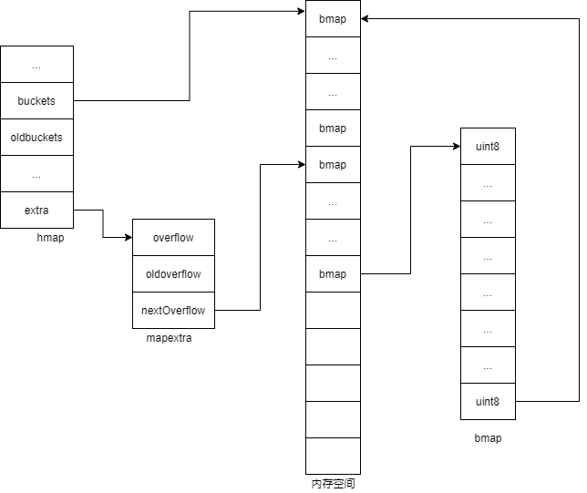
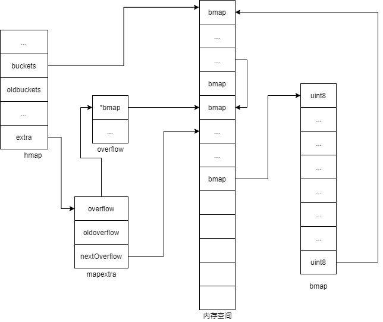

# map
- go version 1.7
## map基本操作
### map的创建与赋值
```go
var m map[int]int
m = map[int]int{1:1,2:2}

m := map[int]int{1:1,2:2}

// make(map[keytype]valuetype, cap) cap初始容量
m :=make(map[int]int,100)
m = map[int]int{1:1,2:2}

m[3]=3
```
### ok测试键值对是否存在

```go
_, ok := map1[key1] // 如果key1存在则ok == true，否则ok为false
```
### map删除元素
```go
m := map[int]int{1:1,2:2}
delete(m,1)
```
### map的遍历
```go
m := map[int]int{1:1,2:2}
for k,v:= range m{
    fmt.Println(k,v)
}
```
## map刨析
### 重要的数据结构
```go
// src/runtime/map.go

type hmap struct {
	count     int // 当前保存的元素个数
	flags     uint8
	B         uint8  // buckets数组大小(2^B)  范围2^0-2^255
	noverflow uint16 
	hash0     uint32 

	buckets    unsafe.Pointer // 桶数组,如果为nil,则count=0
	oldbuckets unsafe.Pointer // previous bucket array of half the size, non-nil only when growing
	nevacuate  uintptr       

	extra *mapextra // 可选字段
}

type mapextra struct {
	// buckets的溢出桶数组
	overflow    *[]*bmap
	// oldbuckets的溢出桶数组
	oldoverflow *[]*bmap
	// 空闲溢出桶数组
	nextOverflow *bmap
}

// 桶结构
type bmap struct {
	// bucketCnt 代表一个桶最多可存储的8个
	// tophash 通常包含此桶中每个键的哈希值的最高字节。
	tophash [bucketCnt]uint8 
}
```
### map创建
```go
func makeBucketArray(t *maptype, b uint8, dirtyalloc unsafe.Pointer) (buckets unsafe.Pointer, nextOverflow *bmap) {
	base := bucketShift(b)
	nbuckets := base
	if b >= 4 {
		nbuckets += bucketShift(b - 4)
		sz := t.bucket.size * nbuckets
		up := roundupsize(sz)
		if up != sz {
			nbuckets = up / t.bucket.size
		}
	}

	if dirtyalloc == nil {
		buckets = newarray(t.bucket, int(nbuckets))
	} else {
		buckets = dirtyalloc
		size := t.bucket.size * nbuckets
		if t.bucket.ptrdata != 0 {
			memclrHasPointers(buckets, size)
		} else {
			memclrNoHeapPointers(buckets, size)
		}
	}

	if base != nbuckets {
		nextOverflow = (*bmap)(add(buckets, base*uintptr(t.bucketsize)))
		last := (*bmap)(add(buckets, (nbuckets-1)*uintptr(t.bucketsize)))
		last.setoverflow(t, (*bmap)(buckets))
	}
	return buckets, nextOverflow
}
```
makeBucketArray()会使hmap大致呈现如下图所示结构(不同条件下可能有所不同,意义不大,所以不深入讨论)

### 元素的更新或插入
- 跟据key值算出哈希值
- 取哈希值低位与hmap.B取模确定bucket位置
- 依次遍历桶
- 如果找到key,则直接更新
- 如果遇到空单元格且不是bucket的最后一个单元格,则插入
- 否则桶溢出
```go
func mapassign(t *maptype, h *hmap, key unsafe.Pointer) unsafe.Pointer {
	if h == nil {
		panic(plainError("assignment to entry in nil map"))
	}
	if raceenabled {
		callerpc := getcallerpc()
		pc := funcPC(mapassign)
		racewritepc(unsafe.Pointer(h), callerpc, pc)
		raceReadObjectPC(t.key, key, callerpc, pc)
	}
	if msanenabled {
		msanread(key, t.key.size)
	}
	if h.flags&hashWriting != 0 {
		throw("concurrent map writes")
	}
	hash := t.hasher(key, uintptr(h.hash0))

	h.flags ^= hashWriting

	if h.buckets == nil {
		h.buckets = newobject(t.bucket)
	}

again:
	bucket := hash & bucketMask(h.B)
	if h.growing() {
		growWork(t, h, bucket)
	}
	b := (*bmap)(add(h.buckets, bucket*uintptr(t.bucketsize)))
	top := tophash(hash)

	var inserti *uint8
	var insertk unsafe.Pointer
	var elem unsafe.Pointer
bucketloop:
	for {
		for i := uintptr(0); i < bucketCnt; i++ {
			// 如果当前单元格不匹配
			if b.tophash[i] != top {
				// 匹配到空的单元格,做好插入前期准备
				if isEmpty(b.tophash[i]) && inserti == nil {
					inserti = &b.tophash[i]
					insertk = add(unsafe.Pointer(b), dataOffset+i*uintptr(t.keysize))
					elem = add(unsafe.Pointer(b), dataOffset+bucketCnt*uintptr(t.keysize)+i*uintptr(t.elemsize))
				}
				// 如果是桶的最后一个单元格,则溢出
				if b.tophash[i] == emptyRest {
					break bucketloop
				}
				continue
			}
			// 插入数据
			k := add(unsafe.Pointer(b), dataOffset+i*uintptr(t.keysize))
			if t.indirectkey() {
				k = *((*unsafe.Pointer)(k))
			}
			if !t.key.equal(key, k) {
				continue
			}
			// already have a mapping for key. Update it.
			if t.needkeyupdate() {
				typedmemmove(t.key, k, key)
			}
			elem = add(unsafe.Pointer(b), dataOffset+bucketCnt*uintptr(t.keysize)+i*uintptr(t.elemsize))
			goto done
		}
		// 溢出
		ovf := b.overflow(t)
		if ovf == nil {
			break
		}
		b = ovf
	}

	if !h.growing() && (overLoadFactor(h.count+1, h.B) || tooManyOverflowBuckets(h.noverflow, h.B)) {
		hashGrow(t, h)
		goto again 
	}

	if inserti == nil {
		newb := h.newoverflow(t, b)
		inserti = &newb.tophash[0]
		insertk = add(unsafe.Pointer(newb), dataOffset)
		elem = add(insertk, bucketCnt*uintptr(t.keysize))
	}

	if t.indirectkey() {
		kmem := newobject(t.key)
		*(*unsafe.Pointer)(insertk) = kmem
		insertk = kmem
	}
	if t.indirectelem() {
		vmem := newobject(t.elem)
		*(*unsafe.Pointer)(elem) = vmem
	}
	typedmemmove(t.key, insertk, key)
	*inserti = top
	h.count++

done:
	if h.flags&hashWriting == 0 {
		throw("concurrent map writes")
	}
	h.flags &^= hashWriting
	if t.indirectelem() {
		elem = *((*unsafe.Pointer)(elem))
	}
	return elem
}
```
### 桶溢出
```go
func (h *hmap) newoverflow(t *maptype, b *bmap) *bmap {
	var ovf *bmap
	if h.extra != nil && h.extra.nextOverflow != nil {
		ovf = h.extra.nextOverflow
		if ovf.overflow(t) == nil {
			h.extra.nextOverflow = (*bmap)(add(unsafe.Pointer(ovf), uintptr(t.bucketsize)))
		} else {
			ovf.setoverflow(t, nil)
			h.extra.nextOverflow = nil
		}
	} else {
		ovf = (*bmap)(newobject(t.bucket))
	}
	h.incrnoverflow()
	if t.bucket.ptrdata == 0 {
		h.createOverflow()
		*h.extra.overflow = append(*h.extra.overflow, ovf)
	}
	b.setoverflow(t, ovf)
	return ovf
}
```
newoverflow()是桶溢出的关键实现,可能会呈现如下结构


### map扩容
-
- 太多的溢出桶
```go
// overLoadFactor reports whether count items placed in 1<<B buckets is over loadFactor.
func overLoadFactor(count int, B uint8) bool {
	return count > bucketCnt && uintptr(count) > loadFactorNum*(bucketShift(B)/loadFactorDen)
}

// tooManyOverflowBuckets reports whether noverflow buckets is too many for a map with 1<<B buckets.
// Note that most of these overflow buckets must be in sparse use;
// if use was dense, then we'd have already triggered regular map growth.
func tooManyOverflowBuckets(noverflow uint16, B uint8) bool {
	// If the threshold is too low, we do extraneous work.
	// If the threshold is too high, maps that grow and shrink can hold on to lots of unused memory.
	// "too many" means (approximately) as many overflow buckets as regular buckets.
	// See incrnoverflow for more details.
	if B > 15 {
		B = 15
	}
	// The compiler doesn't see here that B < 16; mask B to generate shorter shift code.
	return noverflow >= uint16(1)<<(B&15)
}

// growing reports whether h is growing. The growth may be to the same size or bigger.
func (h *hmap) growing() bool {
	return h.oldbuckets != nil
}

func hashGrow(t *maptype, h *hmap) {
	// If we've hit the load factor, get bigger.
	// Otherwise, there are too many overflow buckets,
	// so keep the same number of buckets and "grow" laterally.
	bigger := uint8(1)
	if !overLoadFactor(h.count+1, h.B) {
		bigger = 0
		h.flags |= sameSizeGrow
	}
	oldbuckets := h.buckets
	newbuckets, nextOverflow := makeBucketArray(t, h.B+bigger, nil)

	flags := h.flags &^ (iterator | oldIterator)
	if h.flags&iterator != 0 {
		flags |= oldIterator
	}
	// commit the grow (atomic wrt gc)
	h.B += bigger
	h.flags = flags
	h.oldbuckets = oldbuckets
	h.buckets = newbuckets
	h.nevacuate = 0
	h.noverflow = 0

	if h.extra != nil && h.extra.overflow != nil {
		// Promote current overflow buckets to the old generation.
		if h.extra.oldoverflow != nil {
			throw("oldoverflow is not nil")
		}
		h.extra.oldoverflow = h.extra.overflow
		h.extra.overflow = nil
	}
	if nextOverflow != nil {
		if h.extra == nil {
			h.extra = new(mapextra)
		}
		h.extra.nextOverflow = nextOverflow
	}

	// the actual copying of the hash table data is done incrementally
	// by growWork() and evacuate().
}
```