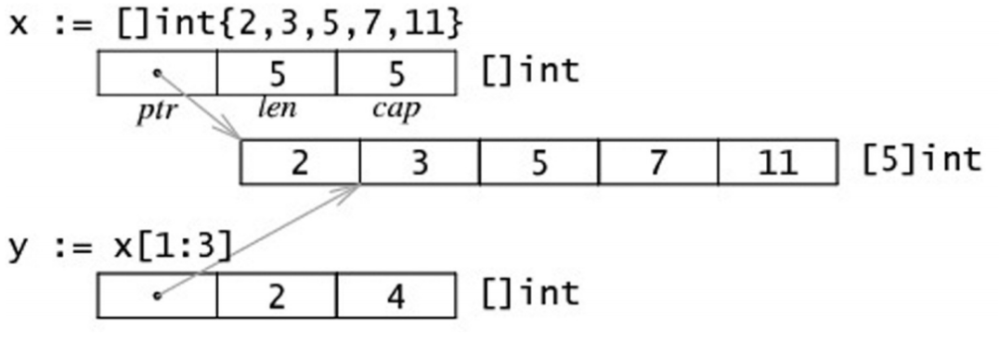

# 数组和切片
## 数组
### 数组的创建
```go
// a 是[3]int类型
var a [3]int 
// a 是*[3]int类型
a = new([3]int)
a[0]=1
a[1]=2
a[2]=3

a := [3]int{1,2,3}

a := [...]int{1,2,3}

a := [5]int{1:1}
```
### Go 语言中的数组是一种值类型，不像 C/C++ 中是指向首元素的指针
```go
func f1(a [3]int){
	a[0] = 11
	fmt.Println(a)
}

func f2(a *[3]int){
	a[0]=12
	fmt.Println(a)
}

func main() {
	a :=[...]int{1,2,3}
	f1(a)
	f2(&a)
	fmt.Println(a)
}
// output:
// [11 2 3]
// &[12 2 3]
// [12 2 3]
```
大数组传递给函数会消耗很多内存。有两种方法可以避免这种现象：
- 传递数组的指针
- 使用数组的切片

## 切片
源码详见[slice.go](./example/src/slice.go)
### 切片结构
```go
type slice struct {
	array unsafe.Pointer
	len   int
	cap   int
}
```

### 切片的创建
```go
a := new([]int)
a := make([]int,0,10)
arr :=[...]int{1,2,3}
a :=arr[:]
```