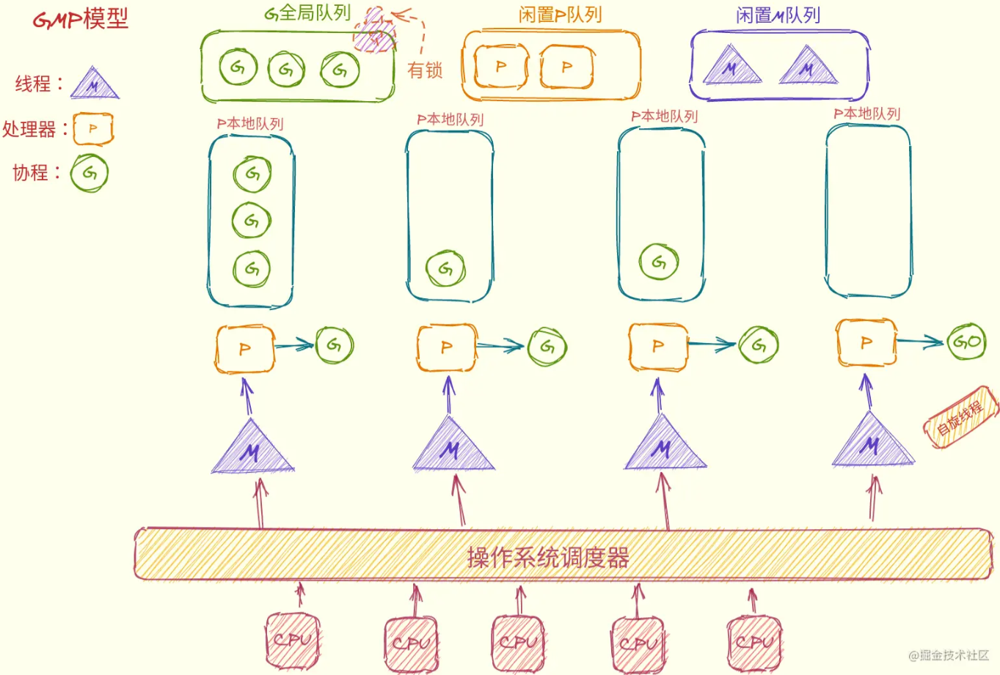
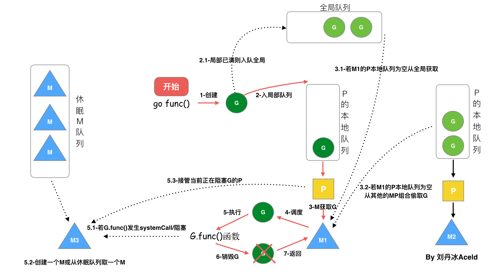
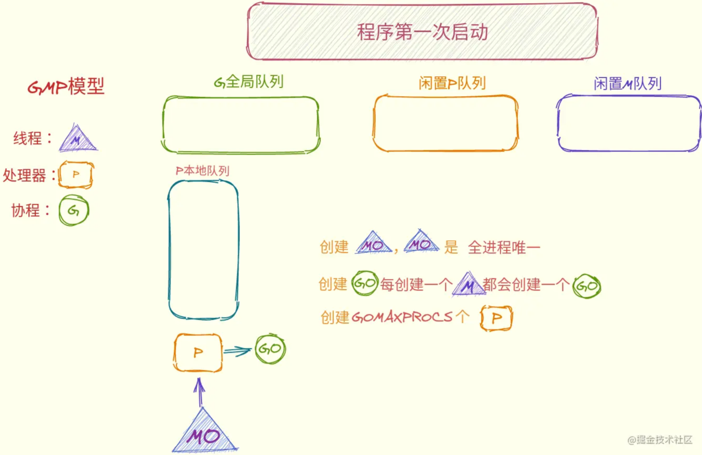

# GMP模型
Golang的GMP模型是用户态线程的以一种实现，内核控制线程(LWP)。

## GMP模型概览

- G：协程，用户态线程
    - G：执行用户任务
    - main gorountine：执行runtim.main
    - G0: 执行调度任务
- M：轻型进程，LWP
- P：协程调度器

自旋线程：当本地P队列为空，当前线程就会变成自旋线程，此时G0不断的寻找可执行的G(优先从全局G队列查找)，然后找到后放入本地P队列，然后P切换到新找到的G继续执行。

### 协程调度器
#### go func()调度流程

- 当G被创建时，优先存储在P的本地队列，如果本地队列已满，将本地P队列前一半打乱顺序，然后和新的G一起放入全局G队列
- M会和一个P绑定，P通过GO从本地队列中取一个可执行状态的G来执行，如果本地队列为空则从全局队列或者其他P的本地队列获取一个G来执行
- hand off：如果当前线程的G进行系统阻塞调用时，此时runtime会将这个M和P解绑，从线程池取出一个空闲的M或者创建一个M来重新绑定
- work stealing：自旋线程是优先从全局G队列里查找可执行的G，当全局G队列也为空时，他就会从其它的P队列里偷取G，然后放入本地P队列。

#### 调度器的生命周期

- M0：程序启动后创建的编号为0的主线程，负责初始化和启动第一个G，之后变和其他M一致
- G0：每个M创建时都会创建G，G0在M上运行，负责调度其他的G，每个M只有一个G0，调度器只能在G0上运行

- runtime创建最初的M0和G0
- 调度器初始化：初始化m0、栈、垃圾回收，以及创建和初始化由GOMAXPROCS个P构成的P列表
- 程序启动时会为runtime.main创建goroutine，称为main goroutine，然后把main goroutine加入到P的本地队列
- 启动M0和P绑定，P通过G0获取到main gorountine
- G拥有栈，M根据G中的栈信息和调度信息设置运行环境
- M运行G
- G退出，再次回到M获取可运行的G，这样重复下去，直到main.main退出，runtime.main执行Defer和Panic处理，或调用runtime.exit退出程序