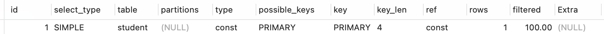
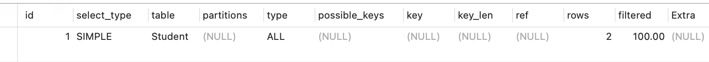

## MySQL Explain



Explain 包含 `id、select_type、table、partitions、type、possible_keys、key、key_len、ref、row、filtered、Extra`。

### id

select查询的序列号

* id相同，执行顺序由上到下。
* id不同，如果是子查询，id的序号会递增，id值越大优先级越高，越先被执行。
* id相同不同同时存在，由大到小再顺序执行。

### select_type

六种类型 `SIMPLE、PRIMARY、SUBQUERY、DERIVED、UNION、UNION RESULT`。

* `SIMPLE` 简单查询，不包含子查询或者UNION。

```sql
EXPLAIN SELECT `ID`,`Name` FROM Student
```



* `PRIMARY` 查询中包含任意复杂的子部分，最外层查询被标记为PRIMARY。
* `SUBQUERY` 在Select或者Where列表中包含的子查询。

```sql
EXPLAIN SELECT `Name` FROM Student WHERE Student.Teacher_Id = (SELECT ID FROM Teacher WHERE `Name` = '昊老师');
```


* `DERIVED` 在FROM列表中子查询生成的临时表。

```sql
EXPLAIN SELECT `Name` FROM Student,(SELECT ID FROM Teacher WHERE `Name` = '昊老师') T WHERE T.ID = Student.Teacher_Id;
```


* `UNION`

  位于union中第二个及其以后的子查询被标记为union，第一个就被标记为primary如果是union位于from中则标记为derived。
* UNION RESULT

  用来从匿名临时表里检索结果的select被标记为union result。

### Type

System>const>eq_ref>ref>range>index>all(全表扫描)。

* system
  表只有一行。
* const表最多只有一行匹配，通用用于主键或者唯一索引比较时。
* eq_ref每次与之前的表合并行都只在该表读取一行，这是除了system，const之外最好的一种，特点是使用=，而且索引的所有部分都参与join且索引是主键或非空唯一键的索引。
* ref如果每次只匹配少数行，那就是比较好的一种，使用=或<=>，可以是左覆盖索引或非主键或非唯一键。
* fulltext全文搜索。
* ref_or_null与ref类似，但包括NULL。
* index_merge表示出现了索引合并优化(包括交集，并集以及交集之间的并集)，但不包括跨表和全文索引。这个比较复杂，目前的理解是合并单表的范围索引扫描（如果成本估算比普通的range要更优的话）。
* unique_subquery在in子查询中，就是value in (select...)把形如“select unique_key_column”的子查询替换。
* index_subquery

  同上，但把形如”select non_unique_key_column“的子查询替换。
* range

  常数值的范围。
* index
  a.当查询是索引覆盖的，即所有数据均可从索引树获取的时候（Extra中有Using Index）；
  b.以索引顺序从索引中查找数据行的全表扫描（无 Using Index）；
  c.如果Extra中Using Index与Using Where同时出现的话，则是利用索引查找键值的意思；
  d.如单独出现，则是用读索引来代替读行，但不用于查找。
* all

  全表扫描

### Prosible Keys

    显示可能应用在这张表中的索引，一个或多个。可能会被使用也有可能不会被使用。

### Key

    实际使用的索引，如果为NULL，则没有使用索引。

### key_len

    使用到索引的长度。在不损失精确性的情况下，长度越短越好 。

### ref

    表示索引的哪一列被使用了，如果可能的话，是一个常数。哪些列或常量被用于查找索引列上的值。

### row

    rows用来表示在SQL执行过程中会被扫描的行数，该数值越大，意味着需要扫描的行数，相应的耗时更长。`这是一个预估值。`

### Extra

    MySQL查询优化器执行查询的过程中对查询计划的重要补充信息。

* Using filesort `坏事`

  通过排序操作，可能是文件来进行排序，也可能是文件来进行排序。效率不如索引来为查询结果排序。
* Using temporary `坏事`

  用临时表保存中间结果，常用于GROUP BY 和 ORDER BY操作中，如果避免不了临时表的使用也要尽量避免 `硬盘临时表`的使用。
* Using index `好事`

  说明查询是覆盖了索引的，不需要读取数据文件，从索引树（索引文件）中即可获得信息。
* Using index condition `好事`

  在索引上执行如like。
* Using where

  使用了WHERE从句来限制哪些行将与下一张表匹配或者是返回给用户。
* Using join buffer

  使用了缓存。
* impossible where `可优化`

  where后面总是 `false`如 `where id = 1 and id = 2`。
* select tables optimized away

  在没有GROUP BY子句的情况下，基于索引优化MIN/MAX操作，或者对于MyISAM存储引擎优化COUNT(*)操作。
* distinct

  优化distinct操作，在找到第一匹配的元组后即停止找同样值的动作。
