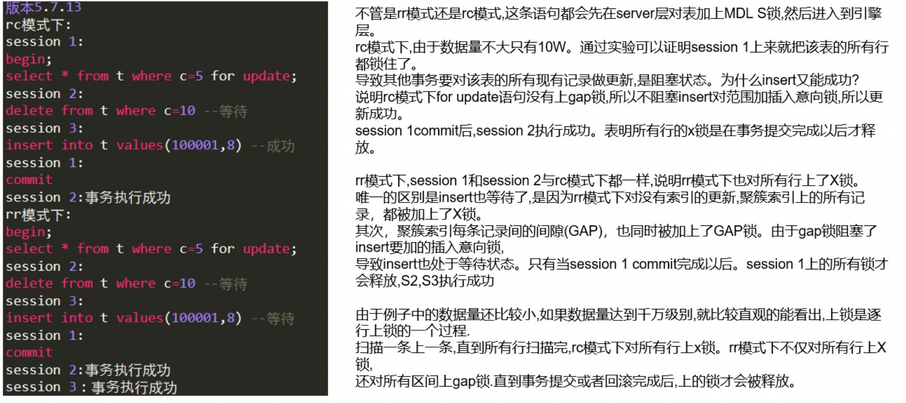

# InnoDB解决幻读

## 幻读的定义

幻读指的是同一个事务在前后两次查询同一个范围的时候，后一次查询看到了前一次查询没有看到的 行。

注意:两个“同一”。

比如，在浏览器中，列表⻚刷新后，看到了之前没有的记录，算不算“幻读” 这里的“查询”，不一定是SELECT FOR UPDATE，更新/删除也算查询(更新/删除后，又看到了未更 新/未删除的记录)

1. 在可重复读隔离级别下，普通的查询是快照读，是不会看到别的事务插入的数据的。因此，幻读 在“当前读”下才会出现。
2. 幻读仅专指“新插入的行”。



## 幻读有什么问题

1 首先、确保语义完整(幻读会破坏语义完整)

T1声明了，“我要把所有 d=5 的行锁住，不准别的事务进行读写操作”

如果不阻止上述 UPDATE 和 INSERT 语句，T1是锁不住“所有”d=5 的行锁住的。因为，UPDATE **和 **INSERT`语句都可以产生新的d=5的行(在SELECT ... FOR UPDATE的时间点以后)

2 其次、确保数据一致性(幻读会破坏数据一致性)

这个语句序列，不论是拿到备库去执行，还是以后用 binlog 来克隆一个库，......发生了数据不一 致。这个问题很严重，是不行的。

这个数据不一致到底是怎么引入的?......这是我们假设......只给 d=5 这一行，也就是 id=5 的这一 行加锁”导致的 ............而根据 binlog 的执行结果是 (1,5,100)，也就是说幻读的问题还是没有解决。为什么我们已经 这么“凶残”地，(假设)把所有的记录都上了锁 ......遇到的“问题”是基于错误的(与现实不符的)假设推理出来的，所以这个问题的真实性? 引出另一个问题:为什么RC隔离级别 + 语句格式的binlog会有问题?

你如果把隔离级别设置为读提交的话，就没有间隙锁了。但同时，你要解决可能出现的数据和日 志不一致问题，需要把binlog 格式设置为 row。这，也是现在不少公司使用的配置组合

## InnoDB解决幻读方式

### 1. 以下语句是如何加锁的

```sql
begin;
select * from t where d=5 for update;
commit;
```

比较好(直观、简单)理解的是，这个语句会命中 d=5 的这一行，对应的主键 id=5，因此在 select 语句执行完成后，id=5 这一行会加一个写锁，而且由于两阶段锁协议，这个写锁会在执行 commit 语句的时候释放。

函数lock_rec_lock 调用7次

### 2. Next-Key Lock

如果把表中所有记录都加X锁，能否阻止 id=1 这一行的插入?

```sql
begin**; **select *** **from **t20 **where **d=**5 for update**;**

-- session 3

insert into **t20 **values**(**1**,**1**,**5**);**

-- ERROR 1205 (HY000): Lock wait timeout exceeded; try restarting transaction
```

为了解决幻读问题，InnoDB 引入新的锁，也就是间隙锁 (Gap Lock) / next-key lock当执行select * from t where d=5 for update 的时候，MySQL不仅给表t中已有的 6 个记录加上了行锁，还同时加了 7 个间隙锁。这样就确保了无法再插入新的记录! 数据行是可以加上锁的实体，数据行之间的间隙，也是可以加上锁的实体

**间隙锁之间都不存在冲突关系**

```sql
-- 示例，select for update 不存在的记录
-- session 1
begin;
select * from t20 where c=7 for update;
-- Empty set (0.01 sec)
-- session 2
begin;
select * from t20 where c=7 for update;
-- Empty set (0.01 sec)
```

这里 session 2 并不会被堵住。因为表 t20 里并没有 c=7 这个记录，因此 session 1 加的是间隙 锁 (5,10)。而 session 2 也是在这个间隙加的间隙锁。它们有共同的目标，即:保护这个间隙，不允许插入值。但，它们之间是不冲突的。

### 3. 操作锁 **S +V +O + C

S:加锁主体，谁来加锁。执行SQL语句的事务加的锁 V:加锁、等待、释放 O:加锁对象、粒度，给谁加锁。给表还是给行 C:加什么样的锁，锁的类型/模式。X, S, IX, IS, GAP, Next-Key, II

### 4. 源代码中锁的定义

锁的类型/模式

mode = Basic lock modes(lock0types.h) + Precise modes(lock0lock.h)

阿里的数据库月报将Precise modes称为record_lock_type，即行锁的类型

| record_lock type (Precise modes) | lock_type | lock_mode (Basic lock modes) |
| -------------------------------- | --------- | ---------------------------- |
| 5bit                             | 4 bit     | 4 bit                        |

```c
enum lock_mode {
LOCK_IS = 0,
LOCK_IX,
LOCK_S,
LOCK_X,
LOCK_AUTO_INC
};
#define LOCK_TABLE 16
#define LOCK_REC 32
#define LOCK_WAIT 256
/* Precise modes */
#define LOCK_ORDINARY 0
#define LOCK_GAP 512
#define LOCK_REC_NOT_GAP 1024
#define LOCK_INSERT_INTENTION 2048
```

对于每个锁对象(lock_t的实例)，有两个维度:

一个是事务维度，每个事务都可以获得锁结构和等待某些锁 

另一个是全局维度，所有的锁都保存在 lock_sys->hash 哈希表中(以 (space_id, page_no) 为key)。无论是表锁还是行锁，都是用结构lock_t来描述

`lock_t` represents either a table lock (lock_table_t) or a group of row locks (lock_rec_t) for all the rowsbelonging to the same page

```c
struct lock_t {
        trx_t*          trx; 
	UT_LIST_NODE_T(lock_t)	trx_locks;
	ulint	type_mode;
	hash_node_t	index;
	union {
		lock_table_t tab_lock;
		lock_rec_t	rec_lock;
	} un_member;
};
```

查看那一页中哪一行被锁住
