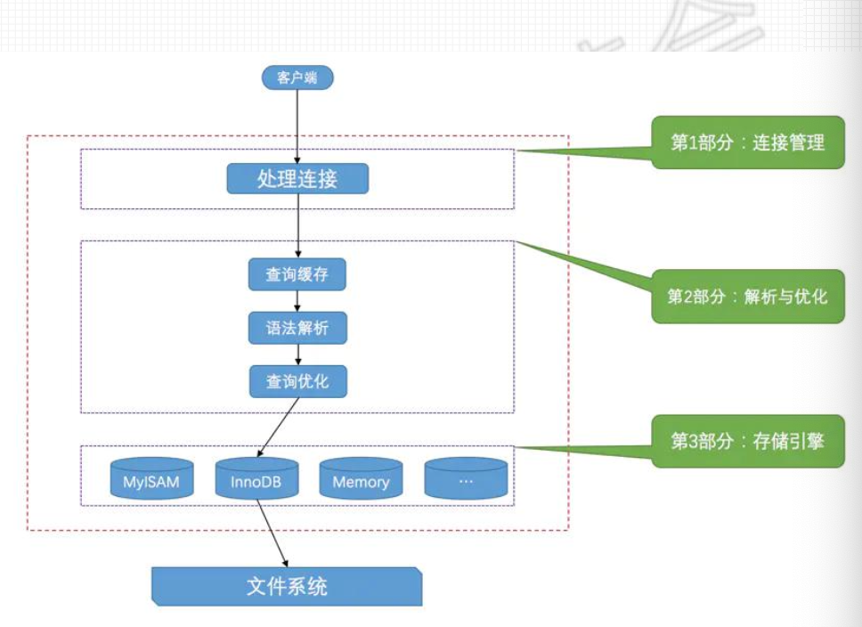
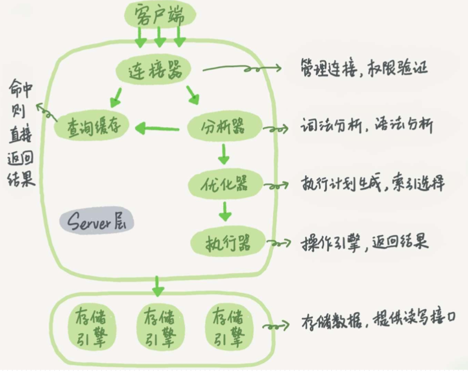
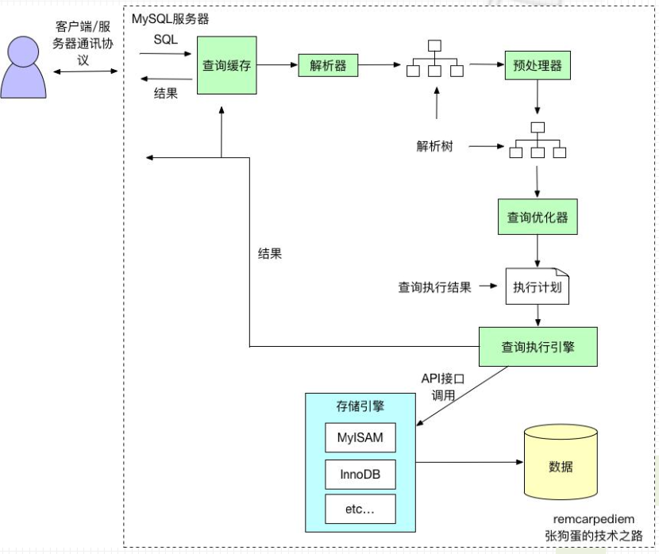
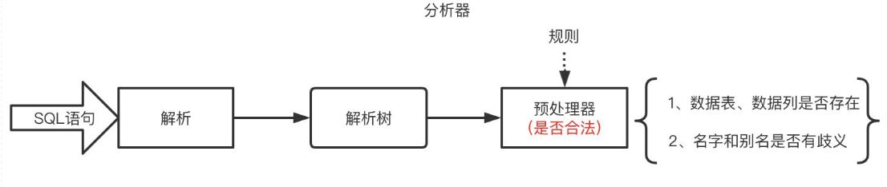
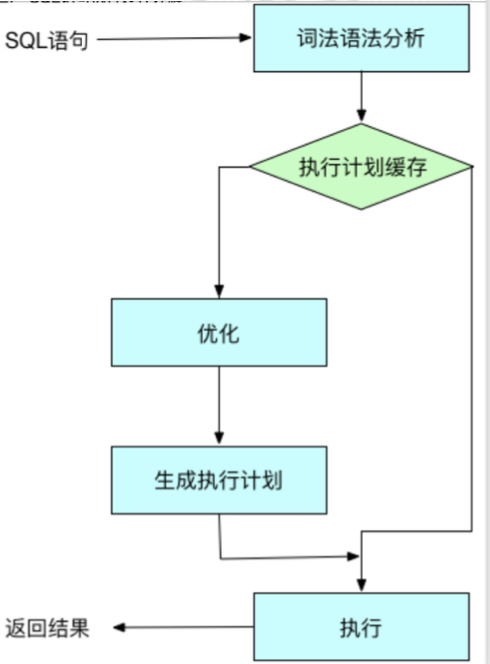
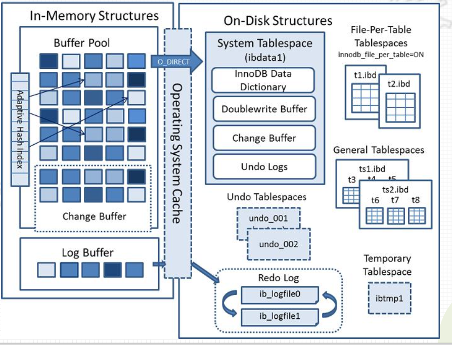
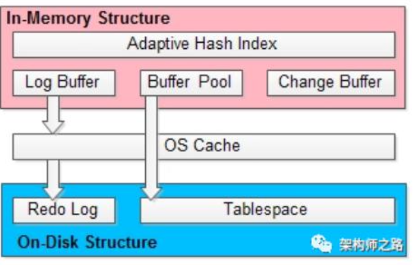
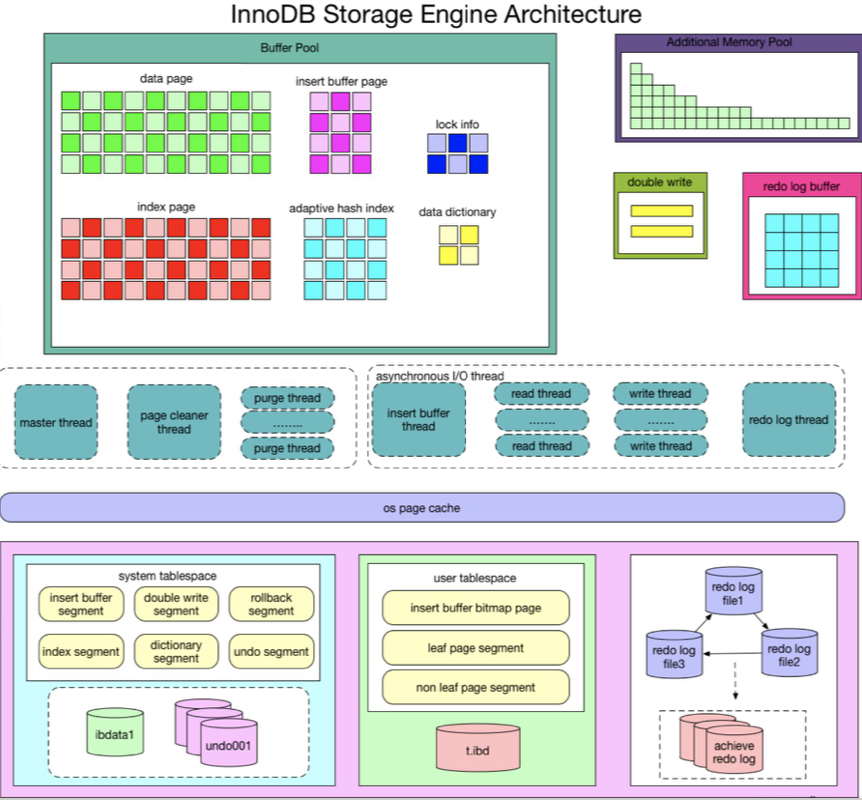
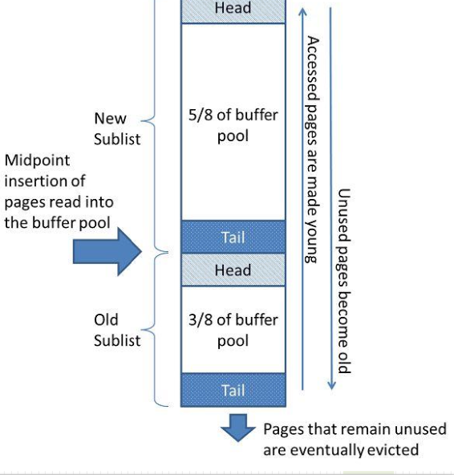

# MySQL——一条SQL查询语句是如何执行的

### InnoDB是如何存储表数据的

* InnoDB其实是使用页为基本单位的，默认页大小为16k
* 对于InnoDB存储引擎来说，每个索引都对应着一棵B+树，该B+树的每个节点都是一个数据页，数据页之间不 必要是物理连续的，因为数据页之间有双向链表来维护着这些页的顺序
* InnoDB的聚簇索引的叶子节点存储了完整的用户记录，也就是所谓的索引即数据，数据即索引

### 系统表空间（system tablespace）

* 系统表空间可以对应文件系统上一个或多个实际的文件，默认，InnoDB会在数据目录下创建一个名为ibdata1

### 独立表空间(file-per-table tablespace)

在MySQL5.6.6以及之后的版本中，InnoDB默认为每一个表建立一个独立表空间。参数innodb_file_per_table控制

### 客户端服务端交互流程

其实不论客户端进程和服务器进程是采用哪种方式进行通信，最后实现的效果都是：客户端进程向服务器进程发送一段文本（MySQL语句），服务器进程处理后再向客户端进程发送一段文本（处理结果）。**MySQL数据库核心在于存储引擎**



Server 层

包括连接器、查询缓存、分析器、优化器、执行器等，涵盖 MySQL 的大多数核心服务功能，以及所有的内置函数（如日期、时间、数学和加密函 等），所有跨存储引擎的功能 都在这一层实现，比如存储过程、触发器、视图等

### 存储引擎层

负责数据的存储和提取，其架构模式是插件式的，支持 InnoDB、MyISAM、Memory 等多个存储引擎



### 向MySQL发送一个请求

请求流程概述

* 客户端发送一条查询给服务器
* 服务器先检查查询缓存，如果命中了缓存，则立 刻返回存储在缓存中的结果，否则进入下一阶段
* 服务器端进行SQL解析、预处理，再由优化器生 成对应的执行计划
* MySQL根据优化器生成的执行计划，再调用存 储引擎的API来执行查询
* 将结果返回给客户端



### 向MySQL发送一个请求--连接器

```bashmysql
mysql -h$ip -P$port -u$user -p
```

（1）如果用户名和密码不对，我们就会收到一个“Access denied for user”的错误，然后客户端程序结束执行 （2）如果用户名跟密码认证通过，连接器会在权限表里查出我所拥有的权限，之后这个连接里面的权限判断逻辑， 都将依赖于此时读到的权限【取与用】 连接完成后，如果我们没有后续的动作，这个连接就处于空闲状态【show processlist】 其中的Command列显示为“Sleep”的这几行，表示现在系统里面存在几个空闲连接。

向MySQL发送一个请求--分析器



### 向MySQL发送一个请求--优化器

查询优化器目标：

* 将解析树转化成执行计划
* 一条查询有多种执行方法（结果相同），找到这其中最好的执行计划

衡量方法：

* 基于成本的查询优化器（Cost-Based Optimizer，CBO）
* 尝试预测一个查询使用某种执行计划时的成本，并选择其中成本最少的一个

依赖：

* 根据优化规则对关系表达式进行转换（多执行计划）
* 统计信息和代价模型（成本计算）



### 向MySQL发送一个请求--执行引擎

各种不同的存储引擎向上边的MySQL server层提供统一的调用接口（也就是存储引擎API），包含了几十个底 层函数，像"读取索引第一条内容"、"读取索引下一条内容"、"插入记录"等等。

* 创建、打开和关闭表
* 对表加锁
* 全表扫描
* 通过索引访问table内容
* 事务处理

### 向MySQL发送一个请求--执行引擎

查询权限判断

* 如果命中查询缓存，会在查询缓存返回结果的时候，做权限验证
* 查询也会在优化器之前调用precheck验证权限
* 执行器判断一下我们对这个表T有没有执行查询的权限

API获取数据

（1）调用InnoDB引擎接口取这张表的第一行，判断ID是否满足条件，如果是则将结果缓存到结果集中，否则跳过

（2）调用引擎接口取“下一行”，重复相同的逻辑判断，直到取到这个表的最后一行。

（3）执行器将上述过程中筛选出来的满足条件的记录行组成的记录及作为结果集返回给客户端

### 向MySQL发送一个请求--返回结果给客户端

* 如果查询可以被缓存，那么MySQL在这个阶段页会将结果存放到查询缓存中
* MySQL将结果集返回给客户端是一个增量、逐步返回的过程。
* 在查询生成第一条结果时，MySQL就可以开始向客户端逐步返回结果集了

### InnoDB体系结构



### InnoDB简要架构

(1)内存结构(In-Memory Structure)，这一层在MySQL服务进程内;

(2)OS Cache，这一层属于内核态内存;

(3)磁盘结构(On-Disk Structure)，这一层在文件系统上



### InnoDB详细架构

InnoDB存储引擎由内存池，后台线程和磁盘文件三大部分组成

Master Thread:刷新脏页到磁盘，保证数据一致性(10秒操作与1秒操作)

IO Thread:大量使用异步处理写IO请求，包括4类IO Thread

 Purge Thread :回收已经使用并分配的undo页

 Page Cleaner Thread :1.2.X版本以上引入， 脏页刷新，减轻master的工作，提高性能



### InnoDB管理单位

将数据划分为若干个页，以页作为磁盘和内存之间交互的基本单位。

InnoDB中页的大小一般为 16 KB，也就是在一般情况下，一次最少从磁盘中读取16KB的内容到内存中，一次最少把内存中的16KB内容刷新到磁盘中。

### **InnoDB**内存架构 **--** **缓冲池**


InnoDB在内存中主要包括下面几个部分:缓冲池、Change缓冲区、自适应哈希索引、Log缓冲区

简介: 存储访问时的缓存表和索引数据【分配80%的物理内存】 

作用: 加快了处理速度，解决CPU速度和磁盘速度之间的鸿沟

技术要点:

* Page:为了高效读取，缓冲池划分为页结构组织
* LRU:当需求添加新的page时，最近最少使用的page被清除，同时新页面被添加到链表的中间部分【优化策略】 这种中间点插入的策略，把链表分为两个子链表 `头部`:最近被访问过的“年轻”页 `尾部`:最近被访问的old page

这样使新子列表中保存更重要的page，旧子列表包含较少使用的 page，这部分page是被清除的候选page



5/8为年轻代缓存池，3/8为长期缓存的缓存区。
