# Order排序详解

## 全字段排序/rowid排序

排序执行流程

查询主键索引获取值至 `sort_buffer`排序返回结果集

* sort_buffer：排序缓存大小
* sort_buffer_size：临时文件、归并排序
* rowid排序： total_length + sortlength > max_length_for_sort_data 回表；

查看sort_buffer

`show variables like "sort_buffer%"\G`

查看max_length

`show variables like "max_length%"\G`

## Optimizer_trace

* filesort_information
  * direction：递增递减
  * table：表
  * fileld：排序字段
* filesort_priority_queue_optimization
  * limit：LIMIT限定长度
  * rows_estimate：预估行数
  * row_size：行长度
  * memory_available：可用内存，sort_buffer_size
* filesort_summary
  * rows：最终行数
  * examined_rows：扫描行数
  * number_of_tmp_files：临时文件数目
  * sort_buffer_size：申请的sort_buffer内存大小
  * sort_mode：排序模式，全字段/rowid

## 优先级队列排序

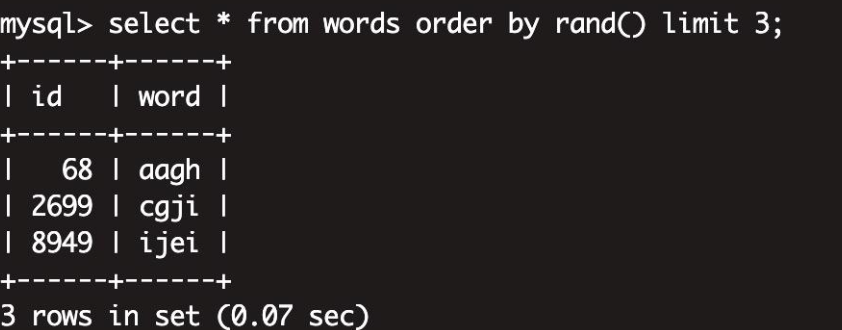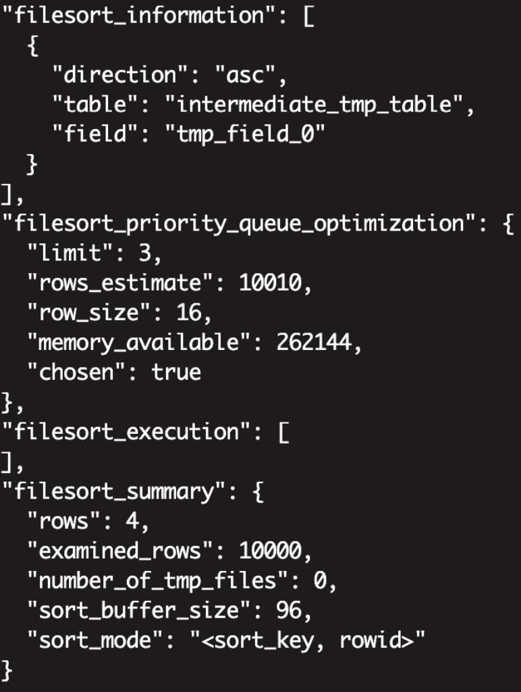

* “table”: “intermediate_tmp_table” 内存临时表，memory引擎;
* “sort_mode”: “<sort_key, rowid>” 内存临时表不需要回表，因此rowid排序;
* “limit”: 3 LIMIT限定获取行数; “chosen”: true 选择优先级队列排序
* “rows_estimate”: 10010 预估行数为什么是10010=10000+10?;预估最大值， stats.records+EXTRA_RECORDS(10) ;
* “row_size”: 16 排序行大小为16字节;内存临时表数组索引8字节+rand排序值*8字节;
* “memory_available”: 262144 sort_buffer大小，256KB;
* “rows”: 4 LIMIT限定行数+1;
* “examined_rows”: 10000 实际扫描行数
* “sort_buffer_size”: 96 申请的sort_buffer大小(行长度行数=(16+8)*4=96)
* “number_of_tmp_files”: 0 选择优先级队列排序了，不需要临时文件
* “sort_buffer_size”: 行长度行数=(row_size+8)*行数 额外的8字节是存储指针的其实际存储模型如下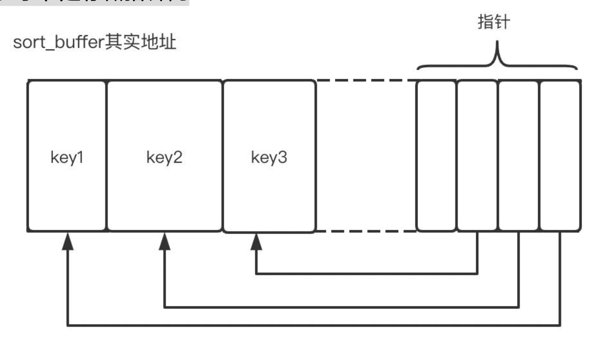

## 非临时表

将内存临时表大小设置为1024

再查询

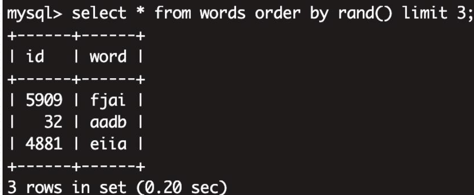

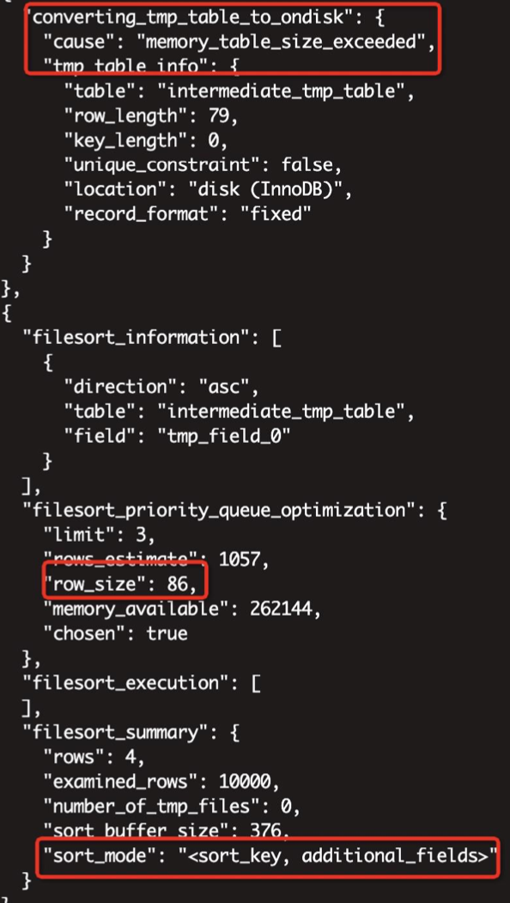

使用的是全字段排序，因为内存表的大小超过限制将其修改为磁盘临时表，如果使用uid排序需要回表进行查询。所以将其全部加载到内存中使用全排序。

* tmp_table_size 内存临时表大小上限，
* “sort_mode”: “<sort_key, additional_fields>” 全字段排序;(磁盘表，INNODB)
* “row_size”: 86 排序行大小总86字节;排序字段rand 8字节+额外字段( rand字段 8字节+id字段4字节+word字段

65字节+1字节null标识)=86 `varchar(64):1字节长度标识+字符串最大64字节 小于256varchar长度表示为1字节超过256表示为2字节`

## 有**LIMIT**一定优先级队列排序吗

设置每行最大长度

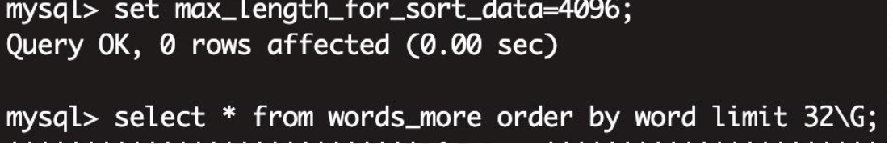

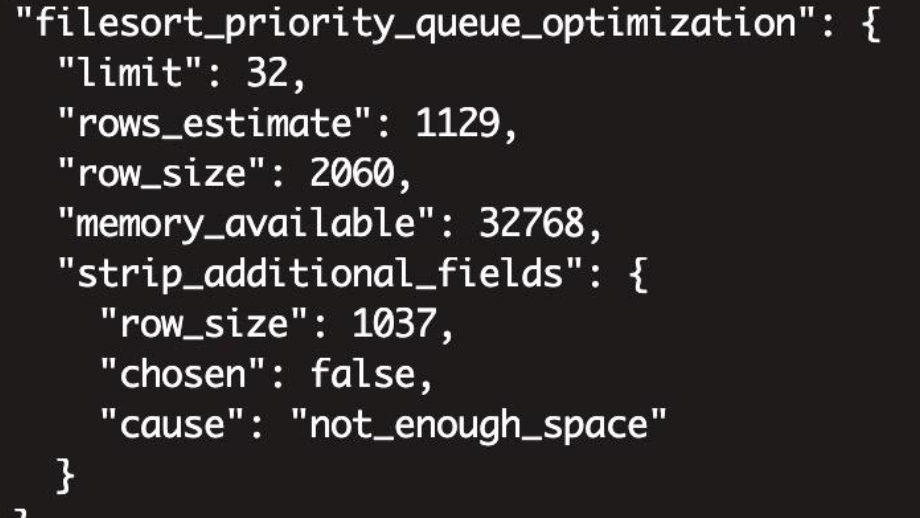

预估1129行，`1129 *2060` < 32768 

    尝试使用rowid排序32768/(1040+8)=31，优先级对了需要32+1，依旧无法存储。最后选着快排，为什么快排可以放下**因为实际大小只有3，mysql会先申请内存在内存中排，只有当内存不够时才会使用文件排序。**

按照weight排序

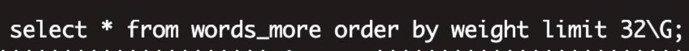

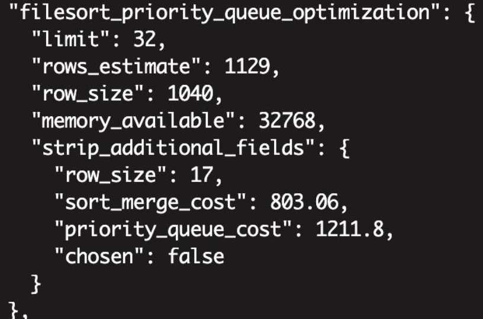

尝试放弃additional_fields，判断rowid排序可否采用优先级队列 (这里比较快排与优先级排序cost)

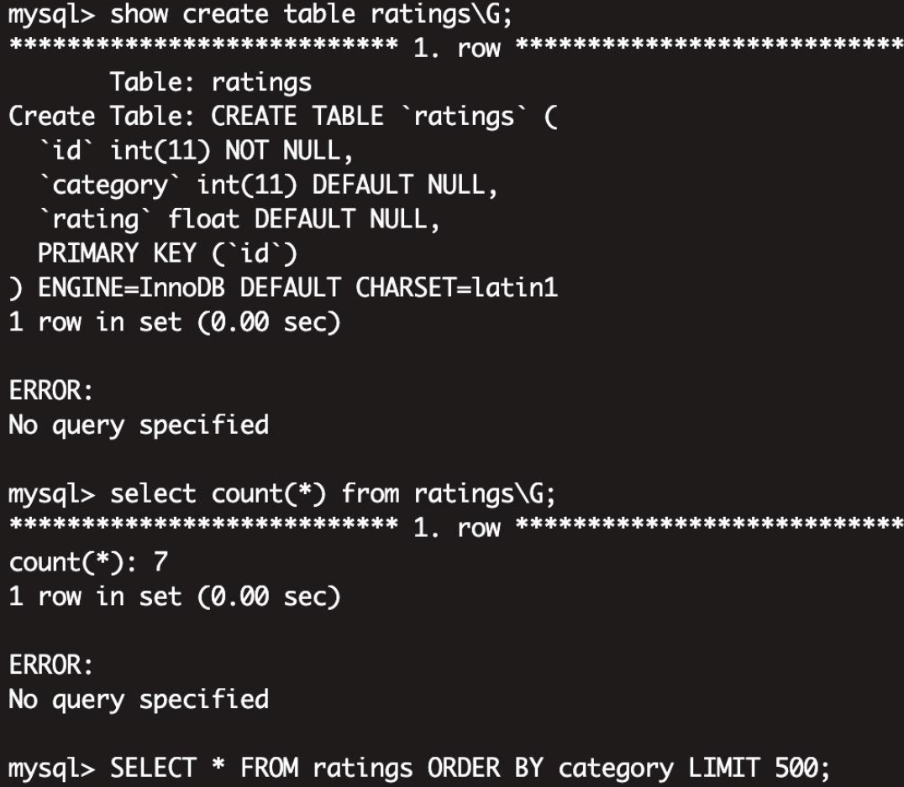

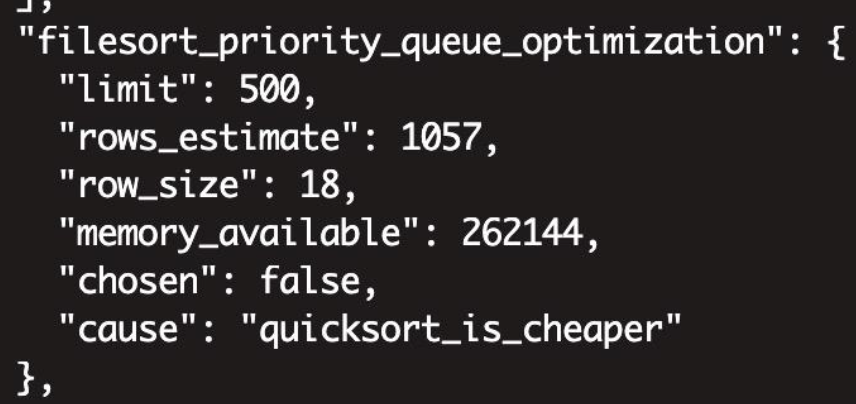

优先级排序速度比快排慢三倍，limit小于总行数的1/3，优先级队列快于快排，其他情况快排快于优先级队列。

## Order by 总结

* 三种方案:快排，优先级队列排序，归并排序(临时文件)
* 三种选择:全字段排序，rowid排序，packed_additional_fields排序
* 全字段排序 VS rowid排序:优先全字段排序 ，避免回表( max_length_for_sort_data)
* 快排 VS 优先级队列排序 :同时可以选择的话，比较cost ;(快排需要预估行数，不准确)
* 快排 VS 归并排序: sort_buffer写满了写临时文件，走归并排序
* 内存临时表:随机读，首选rowid排序( tmp_table_size)

## FileSort流程图

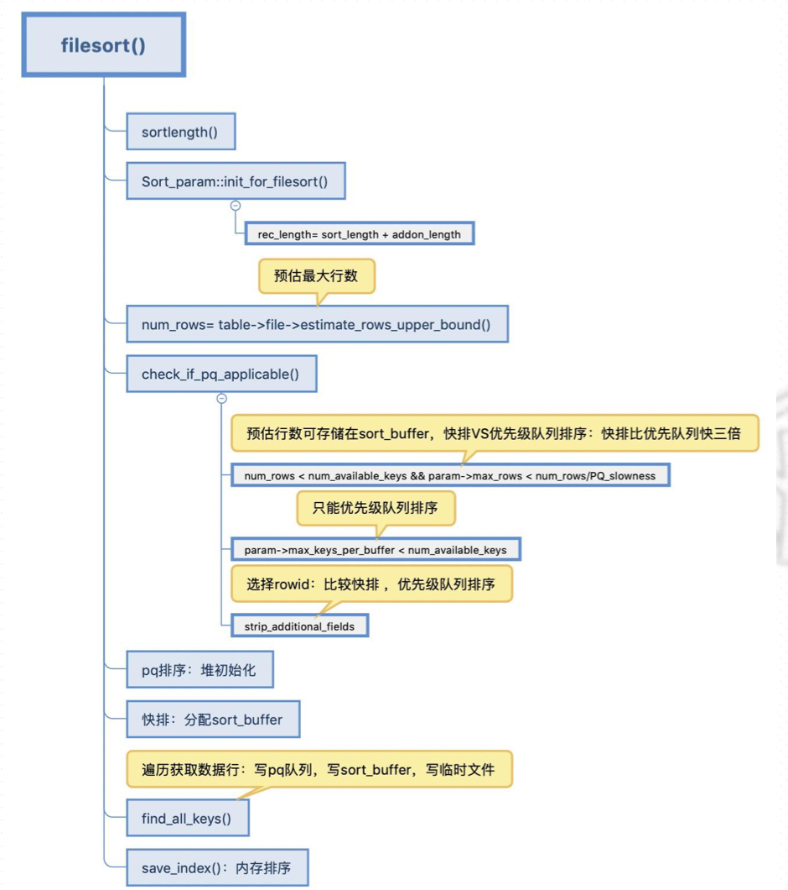
