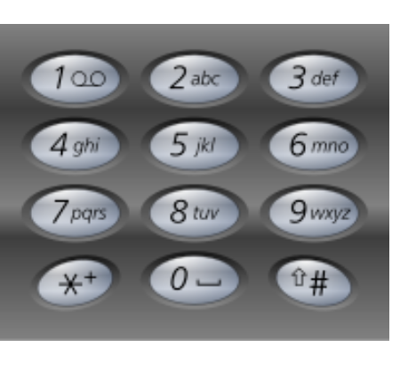
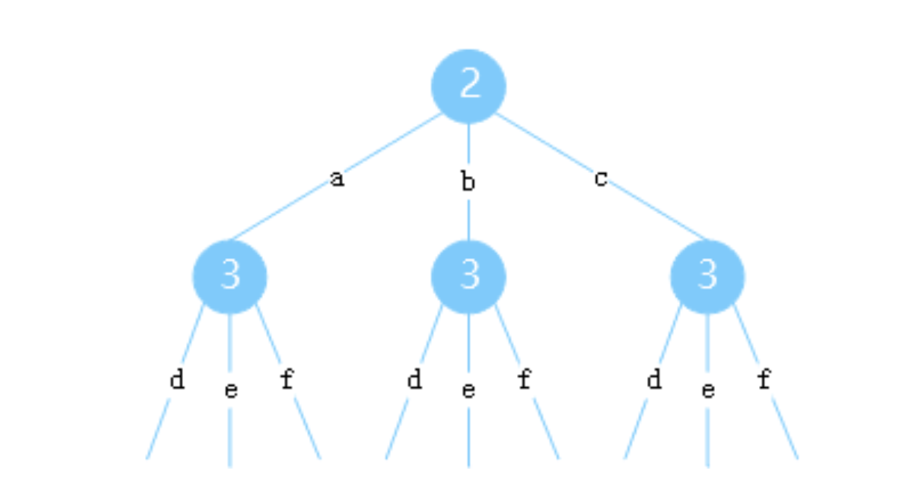

# 17. 电话号码的字母组合

给定一个仅包含数字 2-9 的字符串，返回所有它能表示的字母组合。答案可以按 任意顺序 返回。

给出数字到字母的映射如下（与电话按键相同）。注意 1 不对应任何字母。



**示例 1：**

```
输入：digits = "23"
输出：["ad","ae","af","bd","be","bf","cd","ce","cf"]

```

这个排列组合可以用树的形式表示出来；当给定了输入字符串，比如："23"，那么整棵树就构建完成了，如下：



问题转化成了从根节点到空节点一共有多少条路径，采用bfs进行便利即可得出所有答案

```java
public class Solution {
    public List<String> letterCombinations(String digits) {
        List<String> list = new ArrayList<String>();
dfs(list, "", digits, 0);
        return list;
}

    public void dfs(List<String> list, String result, String digits, int index) {
        if (digits.length() == index) {
            if (!result.equals("")) list.add(result);
            return;
}
        char ch = digits.charAt(index);
        if (ch == '2') {
            dfs(list, result+ "a", digits, index+1);
dfs(list, result+ "b", digits, index+1);
dfs(list, result+ "c", digits, index+1);
} else if (ch == '3') {
            dfs(list, result+ "d", digits, index+1);
dfs(list, result+ "e", digits, index+1);
dfs(list, result+ "f", digits, index+1);
} else if (ch == '4') {
            dfs(list, result+ "g", digits, index+1);
dfs(list, result+ "h", digits, index+1);
dfs(list, result+ "i", digits, index+1);
} else if (ch == '5') {
            dfs(list, result+ "j", digits, index+1);
dfs(list, result+ "k", digits, index+1);
dfs(list, result+ "l", digits, index+1);
} else if (ch == '6') {
            dfs(list, result+ "m", digits, index+1);
dfs(list, result+ "n", digits, index+1);
dfs(list, result+ "o", digits, index+1);
} else if (ch == '7') {
            dfs(list, result+ "p", digits, index+1);
dfs(list, result+ "q", digits, index+1);
dfs(list, result+ "r", digits, index+1);
dfs(list, result+ "s", digits, index+1);
} else if (ch == '8') {
            dfs(list, result+ "t", digits, index+1);
dfs(list, result+ "u", digits, index+1);
dfs(list, result+ "v", digits, index+1);
} else {
            dfs(list, result+ "w", digits, index+1);
dfs(list, result+ "x", digits, index+1);
dfs(list, result+ "y", digits, index+1);
dfs(list, result+ "z", digits, index+1);
}
    }
}
```
