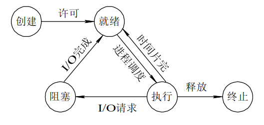
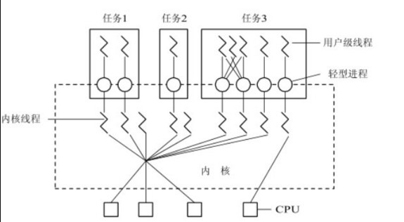

# 进程速览

[进程详细](./详情/进程.md)

## 进程
### 基本定义
进程由程序段、相关的数据段和PCB三部分构成
- PCB：进程控制块，描述、控制、管理进程的数据结构
### 基本属性
- 进程是一个可拥有资源的独立单位
- 进程是一个可独立调度和分派的基本单位

### 基本状态及转换

## 线程
线程是比进程更小的基本单位，可独立调度和分派
### 内核态线程
内核态线程是在内核的支持下运行的，内核可以根据线程控制块感知线程存在并加以控制
### 用户态线程
用户态线程是在用户空间实现的，无需内核支持，内核玩法感知用户态线程的存在

## 用户态线程
### 用户态线程的实现方式
用户态线程是在用户空间上实现的，所有的用户级线程都具有相同的结构，他们都运行在一个中间系统上。当前有两种方式实现中间系统，即运行时系统和内核控制线程
#### 运行时系统
- 用户态线程切换是由运行时系统中的线程切换函数来执行切换任务
- 用户态线程需要系统资源时是将该要求传送给运行时系统，由运行时系统通过相应的系统调用来获得

#### 内核控制线程（轻型进程）
轻量进程(LWP)是建立在内核之上并由内核支持的用户线程，它是内核线程的高度抽象，每一个轻量级进程都与一个特定的内核线程关联。内核态线程只能由内核管理并像普通进程一样被调度。  
当一个用户态线程需要运行时，将她连接到一个LWP上，此时它便具有LWP的所有属性。  

## 内核控制线程具体实现

- 在一个系统中用户态线程数量可能很大，为节省系统开销，将一些LWP做成一个缓冲池，称为"线程池"
- 当用户态线程需要运行时，应该连接到线程池中任意一个LWP上
- 没有连接到LWP上的用户态线程阻塞或者等待LWP
- 用户态线程可以通过连接LWP来访问内核