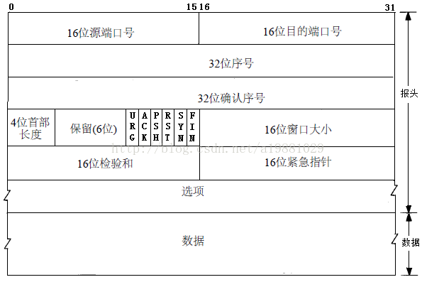

# TCP速览

# [面试必备！TCP协议经典十五连问！ - 知乎 (zhihu.com)](https://zhuanlan.zhihu.com/p/388704023)

## TCP报文段格式



常用参数：

- seq: 序号

- ack: 确认号

- URG：紧急指针

- ACK：确认位

- PSH：

- RST：

- SYN：同步位

- FIN：释放连接

  

## TCP连接管理

### 三次握手建立连接
#### 握手过程

- 第一次：客户端生成随机数作为N作为初始发送序号，发送同步报文SYN=1,seq=N，ACK=0
- 第二次：服务端生成随机数M作为初始发送序号,发送同步报文，对客户端请求进行确认，SYN=1,seq=M,ACK=1,ack=N+1
- 第三次：客户端确认服务端的同步报文，seq=N+1,ACK=1,ack=M+1，客户端可以把数据一起发送出去
#### 三次握手的工作
- 使双方确知对方的存在
- 双方商定了初始传输序号
- 协定了通信参数
#### 三次握手如何保证连接的可靠性
- A的第一次握手数据包发送成功，而B的第二次握手数据包丢失
```
造成的问题：A会等待来自B的确认，而B又在等待来自A的确认
解决方法：B要在收到来自A的确认(第三次握手)在开始等待，不然重发
```
- 如果A发送的第三次握手数据包丢失
```
B会认为连接还未建立，重传第二次握手数据包(5次后会关闭连接)
A认为连接已经建立，如何A发送数据包，B会发送RST拒绝连接
```
- 为什么不对第三次握手进行确认
```
如果对第三次握手进行确认，也无法保证第四次握手数据包不会丢失，最终陷入无休止的确认中去
三次握手是效率与可靠性的权衡结果
```
### 四次挥手关闭连接


## TCP的可靠性控制

### 确认机制

### 重传机制

超时重传

快速重传

定时器

流量控制与拥塞控制


