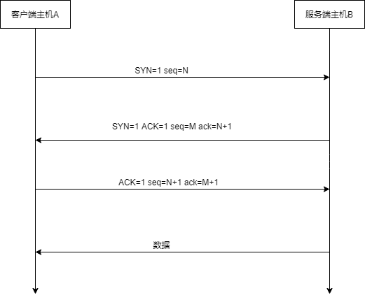

# TCP速览

# [面试必备！TCP协议经典十五连问！ - 知乎 (zhihu.com)](https://zhuanlan.zhihu.com/p/388704023)

## TCP报文段格式


常用参数：

- seq: 序号

- ack: 确认号

- URG：紧急指针

- ACK：确认位

- PSH：

- RST：

- SYN：同步位

- FIN：释放连接

选项:
- 最大报文长度：
- 窗口比例因子：
- 时间戳
- 负确认
  

## TCP连接管理

### 三次握手建立连接
#### 握手过程

- 第一次：客户端生成随机数作为N作为初始发送序号，发送同步报文SYN=1,seq=N，ACK=0
- 第二次：服务端生成随机数M作为初始发送序号,发送同步报文，对客户端请求进行确认，SYN=1,seq=M,ACK=1,ack=N+1
- 第三次：客户端确认服务端的同步报文，seq=N+1,ACK=1,ack=M+1，客户端可以把数据一起发送出去
#### 三次握手的工作
- 使双方确知对方的存在
- 双方商定了初始传输序号
- 协定了通信参数
#### 三次握手如何保证连接的可靠性
- A的第一次握手数据包发送成功，而B的第二次握手数据包丢失
```
造成的问题：A会等待来自B的确认，而B又在等待来自A的确认
解决方法：B要在收到来自A的确认(第三次握手)在开始等待，不然重发
```
- 如果A发送的第三次握手数据包丢失
```
B会认为连接还未建立，重传第二次握手数据包(5次后会关闭连接)
A认为连接已经建立，如何A发送数据包，B会发送RST拒绝连接
```
- 为什么不对第三次握手进行确认
```
如果对第三次握手进行确认，也无法保证第四次握手数据包不会丢失，最终陷入无休止的确认中去
三次握手是效率与可靠性的权衡结果
```
### 四次挥手关闭连接
#### 挥手过程

- A发送FIN报文段，FIN=1,seq=X，X为A发送数据的最后字节序号加1，进入FIN_WAIT_1状态
- B对A的FIN报文段进行确认，ACK=1,seq=Y，ack=X+1,进入CLOSE_WAIT状态
- B发送剩余数据
- B收到对最后数据的确认后，发送FIN报文段，FIN=1,sql=W，进入LAST_ACK状态
- A对B的FIN报文段进行确认，ACK=1，seq=X+1，ack=W+1,进入TIME_WAIT状态，等待2MSL后进入CLOSE状态
- B收到A的确认报文后进入CLOSE状态
#### TIME-WAIT状态为什么需要等待2MSL
- MSL:Maximum Segment Lifetime，即最大段生命周期
- 1个 MSL 保证四次挥手中主动关闭方最后的 ACK 报文能最终到达对端
- 1个 MSL 保证对端没有收到 ACK 那么进行重传的 FIN 报文能够到达
#### 复位TCP连接
```
前面所述为正常情况下的友好关闭连接，但有时也会出现异常情况不得不中途关闭连接，TCP为这种异常情况提供了复位措施，发送RST报文段，RST=1，接收到RST报文段因该立即退出连接
```
```
发生复位的三种情况：
1.连接到不存在的端口
2.出现异常情况
3.空闲时间过长 
```
## TCP的可靠性控制

### 确认机制

### 重传机制

#### 超时重传
发送端在没发送一个报文段的同时要复制一份，将其插入重传队列中，然后启动一个超时时钟，只要在该时钟圭迪昂的时间内没有收到该报文的确认段，就进行重发，直到收到确认段获知重传到规定次数
#### 快速重传
和超时重传机制不同，快速重传并不以时间驱动，而是以数据驱动，它基于接收端反馈的信息来引发重传


发送端连着收到三个重复冗余ACK=3的确认（实际上是4个，但是前面一个是正常的ACK，后面三个才是重复冗余的），便知道哪个报文段在传输过程中丢失了，于是在定时器过期之前，重传该报文段。
#### 带选择确认的重传(SACK)
快速重传还可能会有个问题，ACK只向发送端告知最大的有序报文段，到底是哪个报文丢失了并不确定，该重传多少个包也无法确定
```
上图中，如果seq=4的报文段也丢失，重复的ACK依旧是ack=3，并没有ack=4
```
定时器

## 流量控制与拥塞控制


