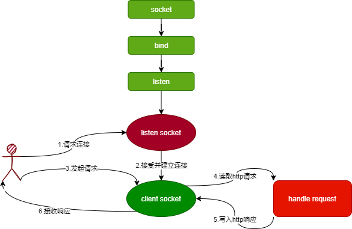

# 网络编程

## Web

### 普通的上网流程

浏览器本身是一个客户端，当你输入 URL 的时候，首先浏览器会去请求 DNS 服务器，通过 DNS 获取相应的域名对应的 IP，然后通过 IP 地址找到 IP 对应的服务器后，要求建立 TCP 连接，等浏览器发送完 HTTP Request（请求）包后，服务器接收到请求包之后才开始处理请求包，服务器调用自身服务，返回 HTTP Response（响应）包；客户端收到来自服务器的响应后开始渲染这个 Response 包里的主体（body），等收到全部的内容随后断开与该服务器之间的 TCP 连接

### Web服务的工作原理

- 客户机通过 TCP/IP 协议建立到服务器的 TCP 连接
- 客户端向服务器发送 HTTP 协议请求包，请求服务器里的资源文档
- 服务器向客户机发送 HTTP 协议应答包，如果请求的资源包含有动态语言的内容，那么服务器会调用动态语言的解释引擎负责处理 “动态内容”，并将处理得到的数据返回给客户端
- 客户机与服务器断开。由客户端解释 HTML 文档，在客户端屏幕上渲染图形结果

### URL（统一资源定位符）

```url
scheme://host[:port#]/path/.../[?query-string]
scheme         指定底层使用的协议(例如：http, https, ftp)
host           HTTP 服务器的 IP 地址或者域名
port#          HTTP 服务器的默认端口是 80，这种情况下端口号可以省略。如果使用了别的端口，必须指明，例如 http://www.cnblogs.com:8080/
path           访问资源的路径
query-string   发送给 http 服务器的数据
```

### DNS解析


## Http协议详解

- 在 HTTP 中，客户端总是通过建立一个连接与发送一个 HTTP 请求来发起一个事务。服务器不能主动去与客户端联系，也不能给客户端发出一个回调连接。客户端与服务器端都可以提前中断一个连接
- HTTP 协议是无状态的，同一个客户端的这次请求和上次请求是没有对应关系，对 HTTP 服务器来说，它并不知道这两个请求是否来自同一个客户端。为了解决这个问题， Web 程序引入了 Cookie 机制来维护连接的可持续状态

**Request 包分为 3 部分，第一部分叫 Request line（请求行）, 第二部分叫 Request header（请求头）, 第三部分是 body（主体）。header 和 body 之间有个空行**

### Http请求包

```shell
GET /example/ HTTP/1.1      // 请求行: 请求方法 请求 URI HTTP 协议/协议版本
Host：www.iana.org               // 服务端的主机名
User-Agent：Mozilla/5.0 (Windows NT 6.1) AppleWebKit/537.4 (KHTML, like Gecko) Chrome/22.0.1229.94 Safari/537.4          // 浏览器信息
Accept：text/html,application/xhtml+xml,application/xml;q=0.9,*/*;q=0.8  // 客户端能接收的 mine
Accept-Encoding：gzip,deflate,sdch       // 是否支持流压缩
Accept-Charset：UTF-8,*;q=0.5        // 客户端字符编码集
// 空行,用于分割请求头和消息体
// 消息体,请求资源参数,例如 POST 传递的参数
```

### Http响应包

```shell
HTTP/1.1 200 OK                     // 状态行
Server: nginx/1.0.8                 // 服务器使用的 WEB 软件名及版本
Date: Tue, 30 Oct 2012 04:14:25 GMT     // 发送时间
Content-Type: text/html             // 服务器发送信息的类型
Transfer-Encoding: chunked          // 表示发送 HTTP 包是分段发的
Connection: keep-alive              // 保持连接状态
Content-Length: 90                  // 主体内容长度
// 空行 用来分割消息头和主体
<!DOCTYPE html PUBLIC "-//W3C//DTD XHTML 1.0 Transitional//EN"... // 消息体
```

## Web Server

```go
package main

import (
 "log"
 "net/http")


func f(w http.ResponseWriter,r *http.Request){
 w.WriteHeader(200)
 w.Write([]byte("hello world"))
}

func main() {
 http.HandleFunc("/",f)
 err := http.ListenAndServe(":8080",nil)
 if err !=nil{
  log.Fatal(err)
 }
}
```

测试

```http
GET / HTTP/1.1
Host: 127.0.0.1:8080
User-Agent: vscode-restclient

HTTP/1.1 200 OK
Date: Tue, 27 Jul 2021 07:03:19 GMT
Content-Length: 11
Content-Type: text/plain; charset=utf-8
Connection: close

hello world
```

## net/http 详解

### http包运行机制



- 创建 Listen Socket, 监听指定的端口，等待客户端请求到来。
- Listen Socket 接受客户端的请求，得到 Client Socket, 接下来通过 Client Socket 与客户端通信。
- 处理客户端的请求，首先从 Client Socket 读取 HTTP 请求的协议头，如果是 POST 方法，还可能要读取客户端提交的数据，然后交给相应的 handler 处理请求，handler 处理完毕准备好客户端需要的数据，通过 Client Socket 写给客户端

### net/http包源码分析

[源码 server.go](https://github.com/golang/go/blob/master/src/net/http/server.go)

#### 连接及请求处理

**err := http.ListenAndServe(":8080",nil)**
http.ListenAndServe()

```go
func ListenAndServe(addr string, handler Handler) error {
 server := &Server{Addr: addr, Handler: handler}
 return server.ListenAndServe()
}
```

**server.ListeAndServe()**

```go
func (srv *Server) ListenAndServe() error {
 if srv.shuttingDown() {
  return ErrServerClosed
 }
 addr := srv.Addr
 if addr == "" {
  addr = ":http"
 }
 ln, err := net.Listen("tcp", addr) // 监听tcp连接
 if err != nil {
  return err
 }
 return srv.Serve(ln) 
}
```

**srv.Serve(ln)**

```go
func (srv *Server) Serve(l net.Listener) error {
 if fn := testHookServerServe; fn != nil {
  fn(srv, l) // call hook with unwrapped listener
 }

 origListener := l
 l = &onceCloseListener{Listener: l}
 defer l.Close()

 if err := srv.setupHTTP2_Serve(); err != nil {
  return err
 }

 if !srv.trackListener(&l, true) {
  return ErrServerClosed
 }
 defer srv.trackListener(&l, false)

 baseCtx := context.Background()
 if srv.BaseContext != nil {
  baseCtx = srv.BaseContext(origListener)
  if baseCtx == nil {
   panic("BaseContext returned a nil context")
  }
 }

 var tempDelay time.Duration // how long to sleep on accept failure

 ctx := context.WithValue(baseCtx, ServerContextKey, srv)
 for {
  rw, err := l.Accept()  // 接受一个tcp连接
  if err != nil {
   select {
   case <-srv.getDoneChan():
    return ErrServerClosed
   default:
   }
   if ne, ok := err.(net.Error); ok && ne.Temporary() {
    if tempDelay == 0 {
     tempDelay = 5 * time.Millisecond
    } else {
     tempDelay *= 2
    }
    if max := 1 * time.Second; tempDelay > max {
     tempDelay = max
    }
    srv.logf("http: Accept error: %v; retrying in %v", err, tempDelay)
    time.Sleep(tempDelay)
    continue
   }
   return err
  }
  connCtx := ctx
  if cc := srv.ConnContext; cc != nil {
   connCtx = cc(connCtx, rw)
   if connCtx == nil {
    panic("ConnContext returned nil")
   }
  }
  tempDelay = 0
  c := srv.newConn(rw) // 创建一个http连接
  c.setState(c.rwc, StateNew, runHooks) // before Serve can return
  go c.serve(connCtx) // 将这个连接交由一个goroutine去服务
 }
}
```

**go c.serve(connCtx)**

```go
func (c *conn) serve(ctx context.Context) {
 c.remoteAddr = c.rwc.RemoteAddr().String()
 ctx = context.WithValue(ctx, LocalAddrContextKey, c.rwc.LocalAddr())
 defer func() {
  if err := recover(); err != nil && err != ErrAbortHandler {
   const size = 64 << 10
   buf := make([]byte, size)
   buf = buf[:runtime.Stack(buf, false)]
   c.server.logf("http: panic serving %v: %v\n%s", c.remoteAddr, err, buf)
  }
  if !c.hijacked() {
   c.close()
   c.setState(c.rwc, StateClosed, runHooks)
  }
 }()

 if tlsConn, ok := c.rwc.(*tls.Conn); ok {
  if d := c.server.ReadTimeout; d > 0 {
   c.rwc.SetReadDeadline(time.Now().Add(d))
  }
  if d := c.server.WriteTimeout; d > 0 {
   c.rwc.SetWriteDeadline(time.Now().Add(d))
  }
  if err := tlsConn.HandshakeContext(ctx); err != nil {
   // If the handshake failed due to the client not speaking
   // TLS, assume they're speaking plaintext HTTP and write a
   // 400 response on the TLS conn's underlying net.Conn.
   if re, ok := err.(tls.RecordHeaderError); ok && re.Conn != nil && tlsRecordHeaderLooksLikeHTTP(re.RecordHeader) {
    io.WriteString(re.Conn, "HTTP/1.0 400 Bad Request\r\n\r\nClient sent an HTTP request to an HTTPS server.\n")
    re.Conn.Close()
    return
   }
   c.server.logf("http: TLS handshake error from %s: %v", c.rwc.RemoteAddr(), err)
   return
  }
  c.tlsState = new(tls.ConnectionState)
  *c.tlsState = tlsConn.ConnectionState()
  if proto := c.tlsState.NegotiatedProtocol; validNextProto(proto) {
   if fn := c.server.TLSNextProto[proto]; fn != nil {
    h := initALPNRequest{ctx, tlsConn, serverHandler{c.server}}
    // Mark freshly created HTTP/2 as active and prevent any server state hooks
    // from being run on these connections. This prevents closeIdleConns from
    // closing such connections. See issue https://golang.org/issue/39776.
    c.setState(c.rwc, StateActive, skipHooks)
    fn(c.server, tlsConn, h)
   }
   return
  }
 }

 // HTTP/1.x from here on.

 ctx, cancelCtx := context.WithCancel(ctx)
 c.cancelCtx = cancelCtx
 defer cancelCtx()

 c.r = &connReader{conn: c}
 c.bufr = newBufioReader(c.r)
 c.bufw = newBufioWriterSize(checkConnErrorWriter{c}, 4<<10)

 for {
  w, err := c.readRequest(ctx)
  if c.r.remain != c.server.initialReadLimitSize() {
   // If we read any bytes off the wire, we're active.
   c.setState(c.rwc, StateActive, runHooks)
  }
  if err != nil {
   const errorHeaders = "\r\nContent-Type: text/plain; charset=utf-8\r\nConnection: close\r\n\r\n"

   switch {
   case err == errTooLarge:
    // Their HTTP client may or may not be
    // able to read this if we're
    // responding to them and hanging up
    // while they're still writing their
    // request. Undefined behavior.
    const publicErr = "431 Request Header Fields Too Large"
    fmt.Fprintf(c.rwc, "HTTP/1.1 "+publicErr+errorHeaders+publicErr)
    c.closeWriteAndWait()
    return

   case isUnsupportedTEError(err):
    // Respond as per RFC 7230 Section 3.3.1 which says,
    //      A server that receives a request message with a
    //      transfer coding it does not understand SHOULD
    //      respond with 501 (Unimplemented).
    code := StatusNotImplemented

    // We purposefully aren't echoing back the transfer-encoding's value,
    // so as to mitigate the risk of cross side scripting by an attacker.
    fmt.Fprintf(c.rwc, "HTTP/1.1 %d %s%sUnsupported transfer encoding", code, StatusText(code), errorHeaders)
    return

   case isCommonNetReadError(err):
    return // don't reply

   default:
    if v, ok := err.(statusError); ok {
     fmt.Fprintf(c.rwc, "HTTP/1.1 %d %s: %s%s%d %s: %s", v.code, StatusText(v.code), v.text, errorHeaders, v.code, StatusText(v.code), v.text)
     return
    }
    publicErr := "400 Bad Request"
    fmt.Fprintf(c.rwc, "HTTP/1.1 "+publicErr+errorHeaders+publicErr)
    return
   }
  }

  // Expect 100 Continue support
  req := w.req
  if req.expectsContinue() {
   if req.ProtoAtLeast(1, 1) && req.ContentLength != 0 {
    // Wrap the Body reader with one that replies on the connection
    req.Body = &expectContinueReader{readCloser: req.Body, resp: w}
    w.canWriteContinue.setTrue()
   }
  } else if req.Header.get("Expect") != "" {
   w.sendExpectationFailed()
   return
  }

  c.curReq.Store(w)

  if requestBodyRemains(req.Body) {
   registerOnHitEOF(req.Body, w.conn.r.startBackgroundRead)
  } else {
   w.conn.r.startBackgroundRead()
  }

  // HTTP cannot have multiple simultaneous active requests.[*]
  // Until the server replies to this request, it can't read another,
  // so we might as well run the handler in this goroutine.
  // [*] Not strictly true: HTTP pipelining. We could let them all process
  // in parallel even if their responses need to be serialized.
  // But we're not going to implement HTTP pipelining because it
  // was never deployed in the wild and the answer is HTTP/2.
  serverHandler{c.server}.ServeHTTP(w, w.req)  // 执行handle
  w.cancelCtx()
  if c.hijacked() {
   return
  }
  w.finishRequest()
  if !w.shouldReuseConnection() {
   if w.requestBodyLimitHit || w.closedRequestBodyEarly() {
    c.closeWriteAndWait()
   }
   return
  }
  c.setState(c.rwc, StateIdle, runHooks)
  c.curReq.Store((*response)(nil))

  if !w.conn.server.doKeepAlives() {
   // We're in shutdown mode. We might've replied
   // to the user without "Connection: close" and
   // they might think they can send another
   // request, but such is life with HTTP/1.1.
   return // 如果Connection 不是keep-alive 则会结束goroutine
  }

  if d := c.server.idleTimeout(); d != 0 {
   c.rwc.SetReadDeadline(time.Now().Add(d))
   if _, err := c.bufr.Peek(4); err != nil {
    return
   }
  }
  c.rwc.SetReadDeadline(time.Time{})
 }
}
```

**serverHandler{c.server}.ServeHTTP(w, w.req)**

```go
func (sh serverHandler) ServeHTTP(rw ResponseWriter, req *Request) {
 handler := sh.srv.Handler
 if handler == nil { 
  handler = DefaultServeMux  // 如果路由处理为nil 则使用默认的路由处理
 }
 if req.RequestURI == "*" && req.Method == "OPTIONS" {
  handler = globalOptionsHandler{}
 }

 if req.URL != nil && strings.Contains(req.URL.RawQuery, ";") {
  var allowQuerySemicolonsInUse int32
  req = req.WithContext(context.WithValue(req.Context(), silenceSemWarnContextKey, func() {
   atomic.StoreInt32(&allowQuerySemicolonsInUse, 1)
  }))
  defer func() {
   if atomic.LoadInt32(&allowQuerySemicolonsInUse) == 0 {
    sh.srv.logf("http: URL query contains semicolon, which is no longer a supported separator; parts of the query may be stripped when parsed; see golang.org/issue/25192")
   }
  }()
 }

 handler.ServeHTTP(rw, req)
}
```

#### 默认路由处理

```go
type ServeMux struct {
 mu    sync.RWMutex
 m     map[string]muxEntry //路由映射表
 es    []muxEntry // slice of entries sorted from longest to shortest.
 hosts bool       // whether any patterns contain hostnames
}

// http.HandleFunc("/",f)  pattern="/" h=f
type muxEntry struct {
 h       Handler
 pattern string
}

type Handler interface {
 ServeHTTP(ResponseWriter, *Request)
}
```

**handler.ServeHTTP(rw, req)**

```go
func (mux *ServeMux) ServeHTTP(w ResponseWriter, r *Request) {
 if r.RequestURI == "*" {
  if r.ProtoAtLeast(1, 1) {
   w.Header().Set("Connection", "close")
  }
  w.WriteHeader(StatusBadRequest)
  return
 }
 h, _ := mux.Handler(r) // 获取Handler
 h.ServeHTTP(w, r) // 执行Handler
}
```